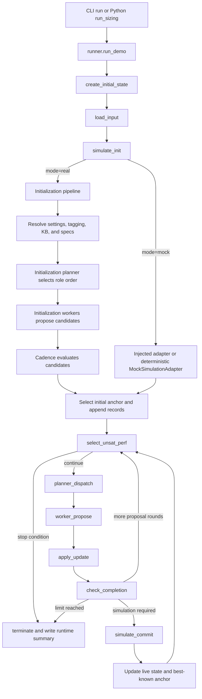

# agentic-sizing

`agentic-sizing` is a research package for LLM-assisted analog-circuit sizing.
It provides a LangGraph workflow, schema-constrained tagging and knowledge-base
tools, deterministic mock simulation, and optional OpenAI and Cadence integrations.

## Install and run

```bash
cd agentic-analog-sizing
python -m pip install -e .
```

Python 3.11 and 3.12 are supported.

Test the deterministic simulator without credentials:

```bash
python examples/mock_simulation.py
```

Run a credential-free workflow smoke test with mock simulation:

```bash
agentic-sizing run \
  --netlist input/tagging/5t_ota \
  --kb-root output/kb \
  --mode mock \
  --max-iter 0
```

## Python API

The same workflow can be called directly from Python or a notebook:

```python
from agentic_sizing import RunConfig, run_sizing

config = RunConfig(
    netlist_path="input/tagging/5t_ota",
    kb_root="output/kb",
    output_dir="output",
    mode="mock",
    max_iter=0,  # Credential-free initialization smoke test.
)

result = run_sizing(config)
print(result.termination_reason)
print(result.best_known_design_vars)
print(result.best_known_perfs)
print(result.simulation_record_path)
```

`RunConfig`, `RunResult`, and `run_sizing` are defined in
[`src/agentic_sizing/api.py`](src/agentic_sizing/api.py) and re-exported from
`agentic_sizing`, so users should import them as shown above. `run_sizing` also
accepts optional `simulator=` and `llm_client=` implementations for custom
research backends. See [`docs/api.md`](docs/api.md) for the supported API surface.

For real Cadence simulation, install the optional dependencies and set the
required paths before running:

```bash
python -m pip install -e '.[openai,cadence]'

# Enter the key without writing it into the repository or shell history.
read -rsp "OpenAI API key: " OPENAI_API_KEY
export OPENAI_API_KEY

# Original Cadence project containing cds.lib and the referenced libraries.
export CADENCE_PROJECT_DIR=/path/to/cadence-project

# Writable location for generated simulation workspaces.
export AGENTIC_SIZING_CADENCE_WORK_ROOT=/path/to/cadence-workspaces

test -f "$CADENCE_PROJECT_DIR/cds.lib"

agentic-sizing run \
  --netlist input/tagging/5t_ota \
  --kb-root output/kb \
  --mode real \
  --max-iter 5
```

The YAML loader substitutes `${CADENCE_PROJECT_DIR}` automatically. If
`AGENTIC_SIZING_CADENCE_WORK_ROOT` is omitted, generated workspaces default to
`output/cadence_workspaces`.

The `cadence` extra does not install Cadence itself; a licensed Virtuoso/Maestro
installation must already be available. Run `agentic-sizing run --help` for all
options. The Python API exposes `RunConfig` and `run_sizing`; see `docs/api.md`.

### Run defaults

Only `--netlist` and `--kb-root` are required. Unspecified options use:

| Option | Default |
|---|---|
| `--mode` | `real` |
| `--max-iter` | `400` |
| `--max-stagnation` | `500` |
| `--max-runtime-seconds` | `0` (no time limit) |
| `--max-planner-worker-iter` | `2` |
| `--simulation-record-path` | `output/simulation_record.json` |
| `--initial-sample-count` | `1` |
| KB input | enabled; disable with `--disable-kb-input` |
| Critical heuristics | enabled; disable with `--disable-heuristics` |
| Continue after meeting specs | disabled; enable with `--continue-after-specs` |
| Include history in CLI output | disabled; enable with `--show-history` |

## Code hierarchy and sizing flow

Both supported entry points use the same workflow:

- CLI: `agentic-sizing run` → `agentic_sizing.cli` →
  `agentic_sizing.workflow.runner`
- Python: `run_sizing(RunConfig(...))` → `agentic_sizing.api` →
  `agentic_sizing.workflow.runner`

The main package is organized by responsibility:

```text
src/agentic_sizing/
├── api.py                 Stable RunConfig, RunResult, and run_sizing API
├── cli.py                 Dispatches run, tag, and extract-kb commands
├── core/                  Shared models, metric aliases, and scoring helpers
├── workflow/
│   ├── runner.py          Creates the initial state and invokes LangGraph
│   ├── graph.py           Declares nodes and edges
│   ├── routing.py         Stop, continue, and simulation-commit decisions
│   ├── state.py           Shared AgenticSizingState definition
│   └── nodes/             One module for each graph operation
├── initialization/        Initial LLM planning, sizing, simulation, and records
├── iteration/
│   ├── iterative_planner.py  Selects a metric and functional role
│   ├── iterative_worker.py   Proposes role-scoped design-variable updates
│   ├── context/              Builds compact planner/worker context
│   └── run_role_perf.py      Maintains temporary run-local evidence
├── kb/                    KB facts, critical heuristics, merge, and runtime seed
├── llm/                   Structured-LLM protocol and OpenAI implementation
├── simulator/             Simulator protocol plus mock and Cadence backends
├── specs/                 Settings conversion and design-spec extraction
├── tagging/               Two-stage netlist tagging pipeline
└── resources/             Packaged prompts loaded with importlib.resources
```

### End-to-end execution



The execution stages are:

1. `runner.run_demo` compiles the graph and creates one `AgenticSizingState`.
   Relative paths are resolved from the current project directory, and the
   simulation record name receives a timestamp prefix.
2. `load_input` establishes the starting specifications, design variables, and
   functional roles. Real initialization replaces these defaults with data
   derived from the selected case.
3. `simulate_init` chooses one of two paths:
   - In `real` mode, `initialization.pipeline` infers the case name, prepares the
     runtime KB, materializes settings, extracts design specs, asks the
     initialization planner and role workers for one or more candidates,
     simulates them, and selects the best initial anchor.
   - In `mock` mode, an injected simulation adapter or the deterministic mock
     adapter evaluates the built-in starting design. A mock run with iterations
     greater than zero can still require an LLM for the iterative planner and
     worker.
4. `select_unsat_perf` compares predicted or simulated performance against the
   typed spec constraints. It selects the first unsatisfied metric, or the
   objective when `--continue-after-specs` is active.
5. `planner_dispatch` builds context from the current state, simulation history,
   operation-region data, KB facts, run-local evidence, and optional critical
   heuristics. The structured LLM chooses a target metric, functional role, and
   worker instruction. It may request a guarded return to the best-known anchor.
6. `worker_propose` asks the role worker for design-variable changes and predicted
   performance. `apply_update` rejects variables outside the selected role and
   updates only the predicted state; it does not yet claim a simulator result.
7. `check_completion` sends the proposal through another planner/worker round or
   forces a real simulation after `max_planner_worker_iter` rounds or predicted
   feasibility.
8. `simulate_commit` evaluates the complete design with the selected backend,
   appends the result to the simulation record, updates run-local role/performance
   evidence, and compares the result with the best-known anchor. Ranking first
   minimizes weighted constraint violation and then optimizes the objective.
9. The loop returns to `select_unsat_perf`. It terminates when all specs are met
   (unless objective continuation is enabled), or when the iteration, stagnation,
   or wall-clock limit is reached.

`iteration` counts committed simulator records, not individual planner/worker
calls. The graph may therefore perform multiple LLM proposal rounds before one
iteration is added to the simulation record.

### Inputs and outputs by layer

| Layer | Reads | Produces |
|---|---|---|
| Tagging | `input/tagging/<case>` | `output/tagging/<case>.tagging.json` |
| Specs | case YAML or `input/kb/<case>_settings.json` | `output/kb/<case>_design_specs.json` |
| KB | tagging, records, and existing facts | `output/kb/pillars/*.json` and `output/critical_heuristics/*.json` |
| Sizing | netlist, settings, tagging, KB, prompts | timestamped simulation and runtime-summary files in `output/` |
| Cadence | case YAML and external Cadence project | workspace under `AGENTIC_SIZING_CADENCE_WORK_ROOT` |

For a record named `<timestamp>_simulation_record.json`, the runtime summary is
`<timestamp>_simulation_record_runtime_summary.json`. Detailed LLM usage is
written to `<timestamp>_simulation_record_llm_usage.jsonl` when usage recording
is configured. Temporary run-local role/performance evidence may exist during a
run and is removed during normal termination.


## Other tools

```bash
agentic-sizing tag --help
agentic-sizing extract-kb --help
```

Cadence is optional and no licensed technology data is distributed. Users must
provide a local Cadence installation, settings, and project template. The large
simulation workspaces in the development checkout are explicitly excluded from
packages and source distributions.

## Reproducibility and data contracts

Prompts and JSON schemas ship as package data. Small examples live under
`examples/`, while public netlist, settings, and improving-design fixtures live
under `input/`. Curated tagging, KB, and heuristic JSON files under `output/`
are public research artifacts; timestamped run records, logs, and simulator
workspaces remain ignored. Randomized built-in strategies use documented
deterministic seeds.

## Development

See [CONTRIBUTING.md](CONTRIBUTING.md), [docs/architecture.md](docs/architecture.md),
[docs/api.md](docs/api.md), and [docs/migration.md](docs/migration.md). Licensed
under the Apache License 2.0.
